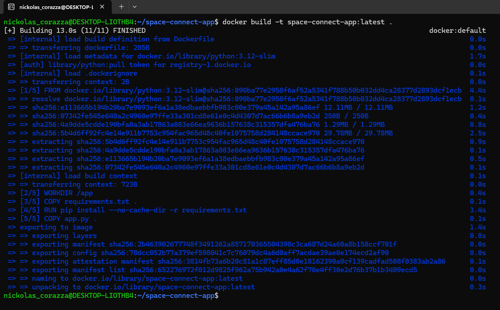
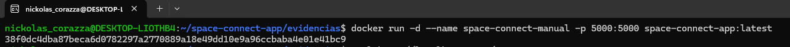
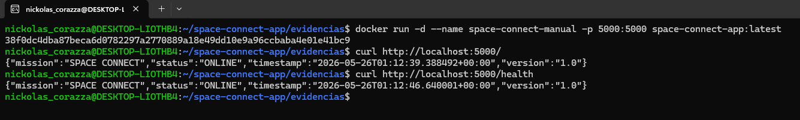
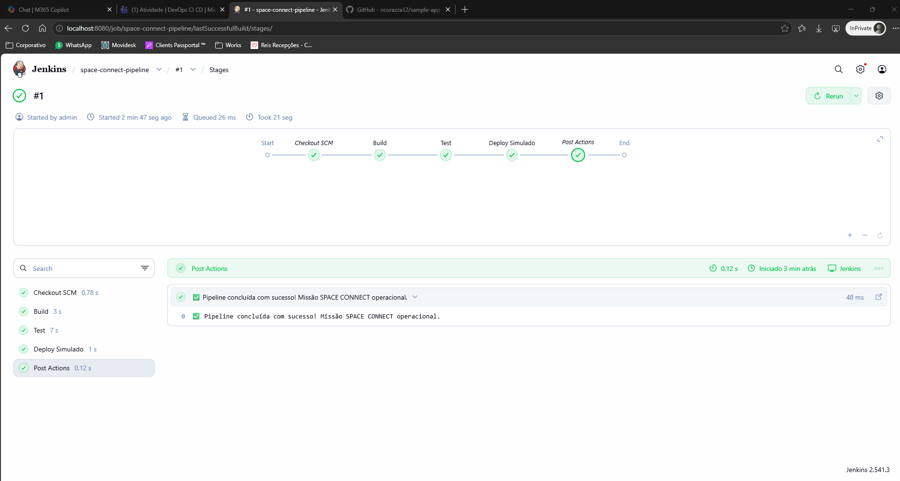
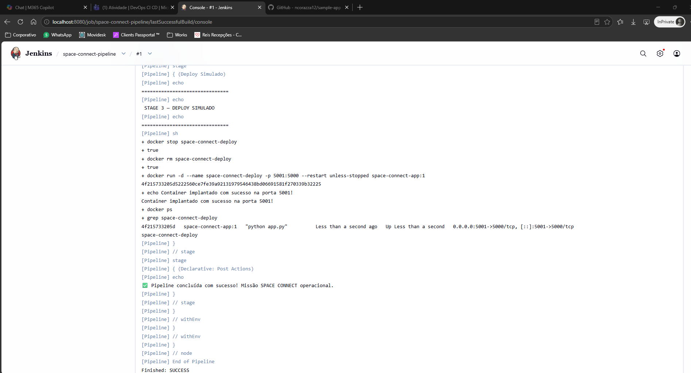
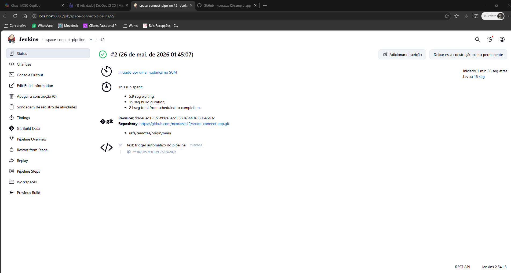

# 🚀 SPACE CONNECT — CI/CD Pipeline


> Projeto desenvolvido para a **Global Solution – DevOps & CI/CD** da FIAP.

---

## 📑 Sumário

- [Sobre o Projeto](#-sobre-o-projeto)
- [Integrantes](#-integrantes)
- [Estrutura do Repositório](#-estrutura-do-repositório)
- [Endpoints da Aplicação](#-endpoints-da-aplicação)
- [Executar Localmente](#-executar-localmente)
- [Pipeline Jenkins CI/CD](#-pipeline-jenkins-cicd)
- [Evidências](#-evidências)
- [Troubleshooting — Port is Already Allocated](#-troubleshooting--port-is-already-allocated)
- [Uso de IA durante a Atividade](#-uso-de-ia-durante-a-atividade)

---

## 📡 Sobre o Projeto

A **SPACE CONNECT** é uma aplicação de monitoramento de sistemas espaciais com pipeline CI/CD automatizada via **Jenkins**, **Docker** e **GitHub**.

A proposta simula um cenário real de DevOps: automatizar a validação e publicação de novas versões de uma aplicação responsável pela comunicação entre sistemas terrestres e satélites da missão.

---

## 👥 Integrantes

| Nome                 | RM       |
|----------------------|----------|
| Nickolas Corazza     | RM562265 |
| Dorivaldo Nascimento | RM565225 |
| Gabriel Lamata       | RM562093 |
| Luiz Parpinelli      | RM566493 |

---

## 📁 Estrutura do Repositório

```
space-connect-app/
├── app.py                  # Aplicação Flask
├── requirements.txt        # Dependências Python
├── Dockerfile              # Container da aplicação
├── Jenkinsfile             # Pipeline CI/CD declarativa
├── README.md
├── jenkins/
│   ├── Dockerfile          # Imagem Jenkins com Docker CLI
│   └── docker-compose.yml  # Orquestração do Jenkins
└── evidencias/
    ├── parte2-docker-build.png
    ├── parte2-docker-run.png
    ├── parte2-curl.png
    ├── docker compose up.png
    ├── Dashboard principal do Jenkins.png
    ├── Terminal com o git push confirmado.png
    ├── Stage View.png
    ├── Curl no Console.png
    ├── parte3-console-output.png
    ├── parte3-jenkins-pipeline-verde.png
    └── parte3-trigger-automatico.png
```

---

## ⚙️ Endpoints da Aplicação

| Endpoint      | Descrição         |
|---------------|-------------------|
| `GET /`       | Status da missão  |
| `GET /health` | Health check      |

**Resposta exemplo:**

```json
{
  "mission": "SPACE CONNECT",
  "version": "1.0",
  "status": "ONLINE",
  "timestamp": "2026-05-25T23:00:00+00:00"
}
```

---

## 🐳 Executar Localmente

```bash
docker build -t space-connect-app:latest .
docker run -d --name space-connect -p 5000:5000 space-connect-app:latest
curl http://localhost:5000/health
```

---

## 🔁 Pipeline Jenkins CI/CD

A pipeline possui **3 estágios**:

| Stage | Descrição |
|-------|-----------|
| **1 — Build** | Constrói a imagem Docker a partir do Dockerfile |
| **2 — Test** | Sobe um container temporário e valida os endpoints com `curl` |
| **3 — Deploy Simulado** | Remove container anterior (se existir) e sobe o novo em produção |

### ▶️ Subir o Jenkins

```bash
cd jenkins/
docker compose up -d --build
```

Acesse: [http://localhost:8080](http://localhost:8080)

---

## 📸 Evidências

### Parte 2 — Dockerização

**Build da imagem Docker:**



---

**Container em execução:**



---

**Endpoints respondendo via curl:**



---

### Parte 3 — Jenkins CI/CD

**Jenkins subindo via Docker Compose:**


---

**Dashboard principal do Jenkins:**


---

**Git push com os arquivos do projeto:**


---

**Pipeline com os 3 stages verdes (Stage View):**



---

**Console Output — curl validando os endpoints:**


---

**Console Output completo do pipeline:**



---

**Pipeline verde — visão geral:**


---

**Trigger automático após push no GitHub:**



---

## 🐛 Troubleshooting — Port is Already Allocated

**Erro:**
```
Error response from daemon: driver failed programming external connectivity
on endpoint [...]: Bind for 0.0.0.0:5001 failed: port is already allocated
```

### O que significa

O Docker tentou mapear uma porta do host (ex: `5001`) para o container, mas essa porta já está sendo utilizada por outro processo ou container no sistema operacional. O Docker Daemon não consegue realizar dois bindings simultâneos na mesma porta.

### Como identificar a causa

```bash
# Ver qual container está ocupando a porta
docker ps --format "table {{.Names}}\t{{.Ports}}" | grep 5001

# Ou no Linux/WSL, ver qual processo usa a porta
sudo ss -tulnp | grep :5001
```

### Como resolver

```bash
# Opção 1: Parar e remover o container que ocupa a porta
docker stop space-connect-deploy
docker rm space-connect-deploy

# Opção 2: Usar uma porta diferente
docker run -d --name space-connect-deploy -p 5003:5000 space-connect-app:latest
```

### Como tratamos no Jenkinsfile

O stage **Deploy Simulado** já resolve isso preventivamente antes de subir o novo container:

```bash
docker stop ${CONTAINER_NAME} 2>/dev/null || true
docker rm   ${CONTAINER_NAME} 2>/dev/null || true
```

O `2>/dev/null || true` garante que, mesmo que o container não exista, o comando não quebre o pipeline.

### Como evitar futuramente

1. Sempre remover containers antigos antes de criar novos (como feito no Jenkinsfile)
2. Usar variáveis de ambiente para as portas, facilitando mudanças sem alterar o código
3. Adotar orquestradores como Docker Compose ou Kubernetes, que gerenciam o ciclo de vida dos containers automaticamente
4. Implementar health checks no pipeline para validar se a porta está livre antes do deploy

---

## 🤖 Uso de IA durante a Atividade

### Como utilizamos

Utilizamos o **Claude (Anthropic)** como assistente técnico durante toda a atividade, especialmente para estruturar os arquivos do projeto e entender as configurações do Jenkins com Docker.

### Prompts utilizados

- *"Me ajude a criar uma aplicação Flask com endpoints `/` e `/health` para uma missão DevOps chamada SPACE CONNECT"*
- *"Como configurar Jenkins rodando em Docker para executar comandos Docker via socket?"*
- *"Crie um Jenkinsfile com 3 stages: Build, Test e Deploy simulado"*
- *"Explique o erro 'port is already allocated' e como resolver no contexto de um pipeline CI/CD"*

### O que foi aproveitado diretamente

A estrutura base dos arquivos `app.py`, `Dockerfile`, `Jenkinsfile` e a lógica de `stop/remove` do container antes do deploy.

### O que precisou ser ajustado manualmente

- Adaptamos o `host.docker.internal` para funcionar especificamente com o Docker Desktop no Windows
- Ajustamos as portas dos stages para não conflitarem com o teste manual da Parte 2
- Preenchemos os dados do grupo no `README.md`

### Como validamos as respostas geradas

Executamos cada comando no terminal e verificamos a saída real. O pipeline foi rodado passo a passo e cada stage foi validado pelo Console Output do Jenkins. Nenhuma resposta foi aceita sem execução e confirmação do funcionamento real.
